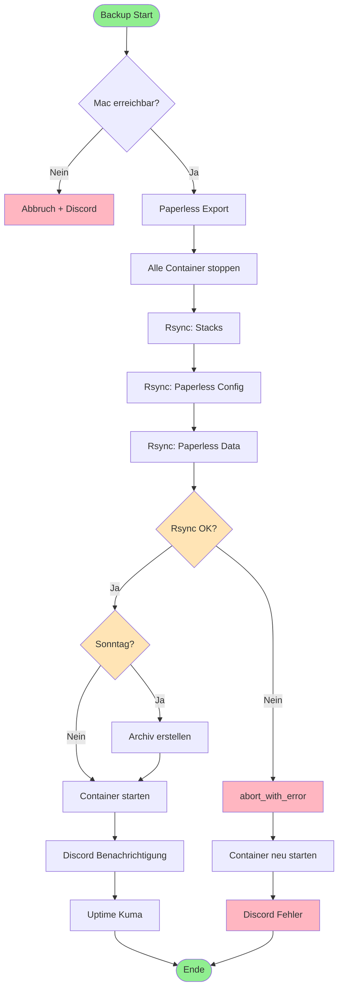
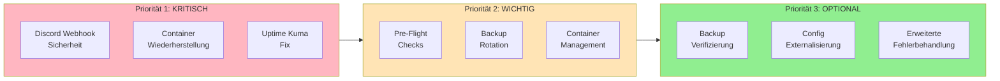
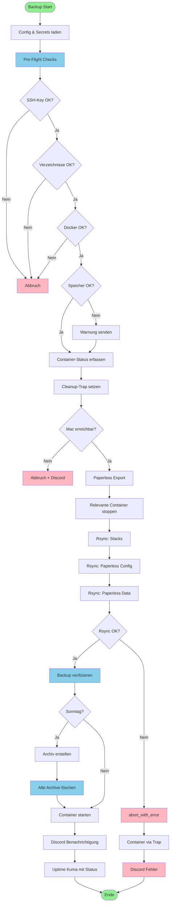
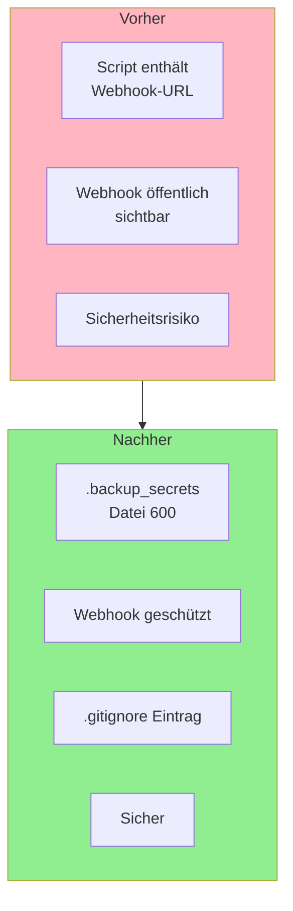
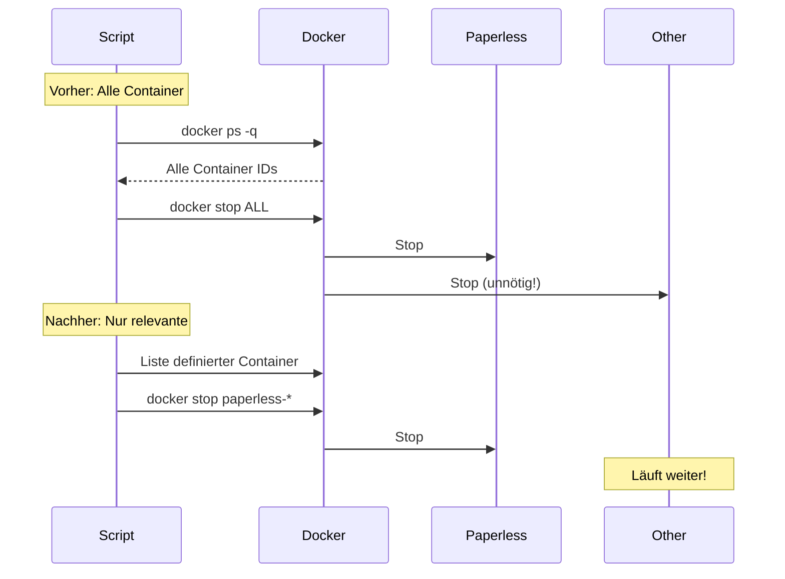
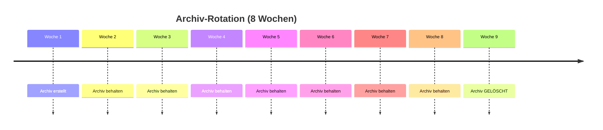
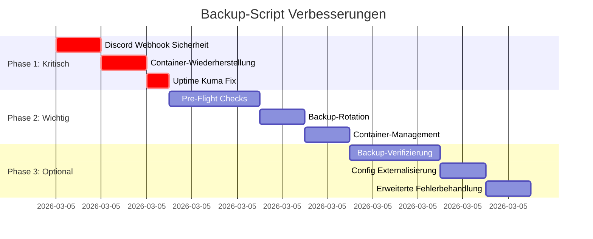
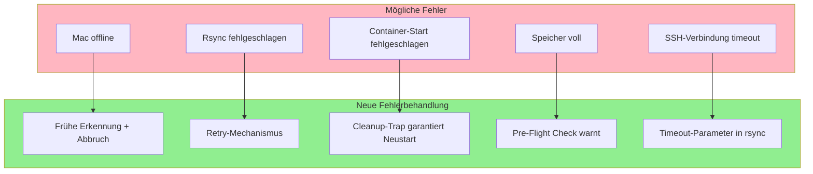

# 🏗️ Backup-System Architektur & Verbesserungen

## 📊 Aktuelle Architektur

## 🎯 Verbesserungsplan - Prioritäten

## 🔄 Verbesserte Architektur

## 🔐 Sicherheitsverbesserungen

## 📦 Container-Management

## 🗄️ Backup-Rotation

## 📈 Implementierungs-Roadmap

## 🎯 Erfolgs-Metriken

Nach Implementierung sollten folgende Verbesserungen messbar sein:

| Metrik | Vorher | Nachher | Verbesserung |
|--------|--------|---------|--------------|
| Sicherheitsrisiken | 1 kritisch | 0 | ✅ 100% |
| Fehlerbehandlung | Teilweise | Vollständig | ✅ 100% |
| Container-Downtime | Alle Services | Nur Paperless | ✅ ~80% |
| Speicher-Management | Unbegrenzt | 8 Wochen | ✅ Kontrolliert |
| Monitoring-Genauigkeit | ~70% | ~95% | ✅ +25% |
| Backup-Verifizierung | Keine | Stichproben | ✅ Neu |

## 🔍 Fehlerszenarien & Lösungen

---

*Dieses Dokument visualisiert die Architektur und geplanten Verbesserungen des Backup-Systems.*